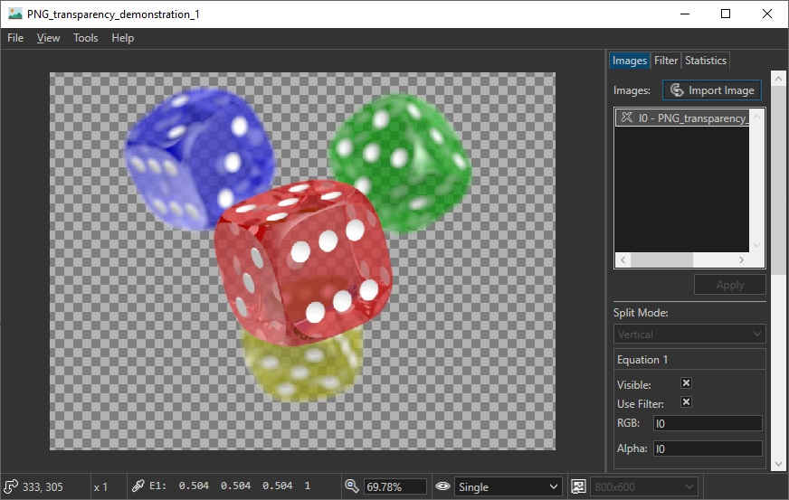
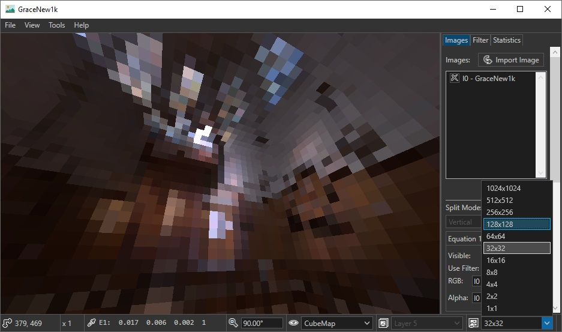
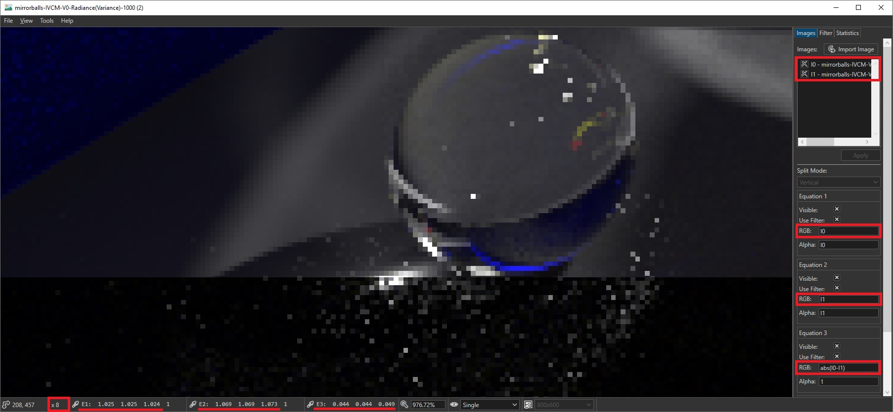

# Image Viewer and Tonemapper

An image viewer for anyone related to computer graphics.

-> [Getting Started Guide](getting_started.md) <-

## File Formats

* bmp, jpg, png, tga, gif
* hdr, pfm, exr (import only)
* dds, ktx, ktx2

## Download

System Requirements:
- x64 bit
- .Net 4.6.1
- DirextX 11 compatible graphics card
- [Microsoft Visual C++ Redistributable for Visual Studio 2019](https://aka.ms/vs/16/release/vc_redist.x64.exe)

Version 3.6 x64 Windows: [Download](https://github.com/kopaka1822/ImageViewer/blob/Release/Build/ImageViewer3_6.7z?raw=true)

Version 3.5 x64 Windows: [Download](https://github.com/kopaka1822/ImageViewer/raw/Release/Build/ImageViewer3_5.zip)

Version 3.3.1 x64 Windows: [Download](https://github.com/kopaka1822/ImageViewer/raw/Release/Build/ImageViewer3_3_1.zip)

Version 2.1 x64 Windows: [Download](https://github.com/kopaka1822/ImageViewer/raw/Release/Build/Texture%20Viewer.zip)

[Used Libraries](about.md)

## Build

If you want to build and debug the Image Viewer, follow the instructions [here](build.md).

## Features 

* quick [side-by-side comparison](#Side-By-Side-Comparision-and-Image-Manipulation)
* [arithmetic image manipulation](equation.md) (image calculator)
* [image statistics](statistics.md) (MSE, SSIM and more)
* [layer, mipmap](#Images-with-multiple-mipmaps-and-faces) and [360° views](#Lat-Long-Polar-Images)
* [lat-long cubemap conversion](#Lat-Long-Cubemap-Conversion)
* [mipmap generation](mipmaps.md) (including box filter and lanczos)
* [customisable filter](#Custom-HLSL-Compute-Shader-Filter) in HLSL
* [3D (volumetric) textures](#3D-Textures)
* computations are done in linear color space

## View Modes
### Simple Images
The status bar displays the current texture coordinates (cursor) along with the corresponding RGBA color values in linear color space. The display type can be changed from linear color space to Srgb color space via: View->Pixel Display->Format.



### Images with multiple mipmaps and faces

Select a specific mipmap level and layer (face) of DDS and KTX textures and view cubemaps in projection or crossview:



### Lat-Long Polar Images

View the raw polar image or look around in polar mode:


### Lat-Long Cubemap Conversion
Convert between Lat-Long and Cubemaps with `Tools->LatLong to Cubemap` and `Tools->Cubemap to LatLong`. You can create a Cubemap or an arbitrary Texture2DArray from multiple images with `File->Import as Array`.

## Side By Side Comparision and Image Manipulation

Compare up to 4 images side by side and use custom formulas to modify the displayed result. Additionally you can use the + and - Key to adjust the exposure.



I0 and I1 are the pixels from the first and the second image. sRGB values are in range [0,1] and you can combine them with following operators: * + - / ^. Numerical constants can be used as well. The detailed image equation guide can be found [here](equation.md).

## Custom HLSL Compute Shader Filter

Filter are HLSL compute shader that can be imported by the ImageViewer. Only a single function needs to be implemented that will be called for each pixel of the image. User defined parameters can be set from within the GUI. Some filter, like the gaussian blur, are already implemented and can be imported via the filter tab:


An example for a simple gamma correction filter would look like this:

```hlsl
// general information about the shader
#setting title, Gamma Correction
#setting description, Nonlinear operation used to encode and decode luminance.

// define displayed name, variable name (for the shader), variable type, default value and optional minmum, maximum
#param Gamma, gamma, float, 1, 0
#param Factor, factor, float, 1.0, 0

// this function will be called once for each pixel
float4 filter(int2 pixelCoord, int2 size)
{
	float4 color = src_image[pixelCoord];

	const float invGamma = 1.0 / gamma;
	color.rgb = pow(abs(color.rgb * factor), float3(invGamma, invGamma, invGamma));
	
	return color;
}
```

The detailed filter guide can be found [here](filter_manual.md).

## 3D Textures

3D textures can be displayed as well and are supported by the majority of image viewer features (export, custom filtering, mipmap generation and more). Simple flat shading and transparency rendering is also supported to help visualize certain datasets.


Additionally, one can explore the insides of a 3D texture by using the "Slice" feature:


For more on 3D textures see [here](volumetric.md).