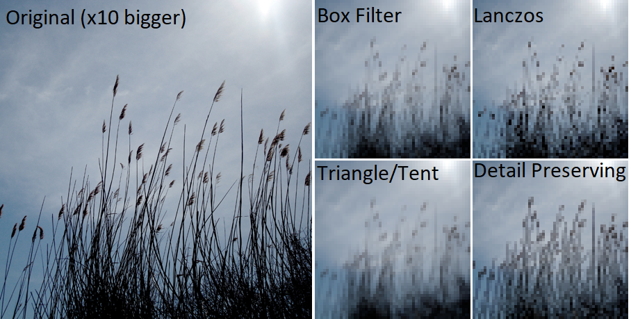
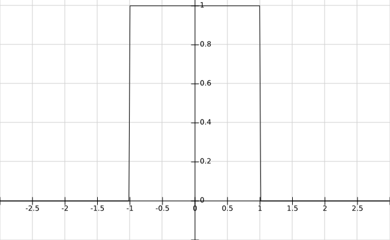
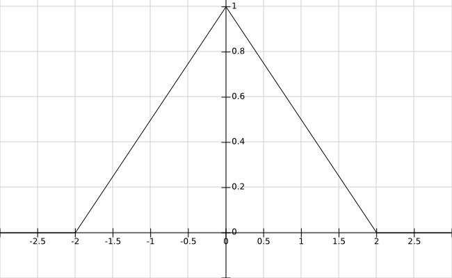
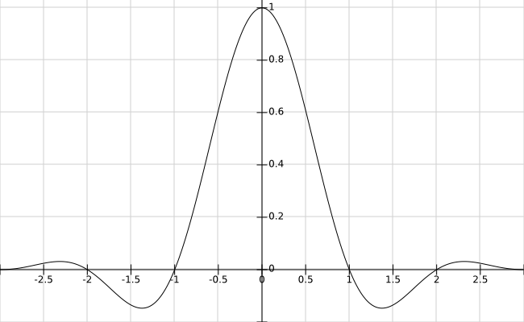

# Mipmaps

Mipmaps can be generated via **Tools->Generate Mipmaps**. The selected mipmap technique(**Tools->Mipmap Technique**) will be used for generating the mipmaps.
By default, the image combination formula and filters will be executed for each mipmap. However, if **Gen Mipmaps** is checked, the mipmaps will be regenerated as a last step. 

## Mipmap Techniques

### Box Filter
This filter uses the average pixel color of all covered pixels (**energy conserving**). High frequencies are not cut off fast enough which might result in **aliasing**. 

### Triangle
Also known as tent filter. The filter kernel is twice as large which results in a blurred image that additionaly keeps its average luminance (**energy conserving**). This **reduces aliasing artifacts**.

### Lanczos

This filter is three times larger than the covored area and contains negative weights. The negative weights result in **edge preservation** during downscaling. It is also derived from the *sinc* function which is the [ideal low-pass filter](https://en.wikipedia.org/wiki/Sinc_filter).

### Detail Preserving

Based on the paper ["Rapid, Detail-Preserving Image Downscaling"](https://www.gcc.tu-darmstadt.de/home/proj/dpid/index.en.jsp) from Nicolas Weber et. al. this filter to preserves colors, that are different from the average color by giving them a higher weight. This results in **detail preservation** because details usually differ from the average pixel color.

## Implementation Notes

### Sample Interpretation
As opposed to sampling theory, each pixel is interpreted as an illuminated quad instead of a single point sample. Thus, we are interested in the area of the kernel function that covers a pixel. Additionaly, we have a well defined behaviour if the pixel is only partially covered, which happens a lot for non power of two textures.

### Alpha Channel
Naive averaging of all channels can result in bleeding of non-existent colors (colors with alpha=0). In order to avoid this, RGB values should be multiplied with alpha before accumulation and renormalized at the end.

