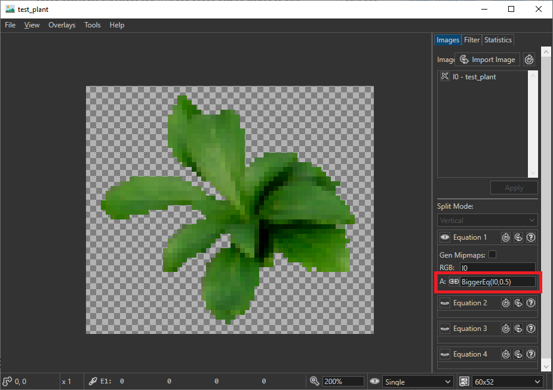

# Mipmaps

Mipmaps can be generated via **Tools->Generate Mipmaps**. The selected mipmap technique(**Tools->Mipmap Technique**) will be used for generating the mipmaps.
By default, the image combination formula and filters will be executed for each mipmap. However, if **Gen Mipmaps** is checked in the image equation tab, the mipmaps will be regenerated as a last step. 
The alpha channel can be adjusted after mipmap generation by enabling **Tools->Alpha Testing**.

## Overview

* [Mipmap Techniques](#mipmap-techniques)
* [Alpha Testing](#alpha-testing)
* [Implementation Notes](#implementation-notes)

## Mipmap Techniques

The mipmap technique can be selected via: **Tools->Mipmap Technique**. After selecting a technique, mipmaps need to be regenerated (**Tools->Delete Mipmaps**, **Tools->Generate Mipmaps** ).

After generating mipmaps, the individual levels can be selected in the status bar at bottom of the image viewer via the image resolution dropdown.


### Box Filter
This filter uses the average pixel color of all covered pixels (**energy conserving**). High frequencies are not cut off fast enough which might result in **aliasing**. This is the default filter used by DirectX and OpenGL. 


### Triangle
Also known as tent filter. The filter kernel is twice as large which results in a blurred image that additionaly keeps its average luminance (**energy conserving**). This **reduces aliasing artifacts**.


### Lanczos

This filter is three times larger than the covored area and contains negative weights. The negative weights result in **edge preservation** during downscaling. It is also derived from the *sinc* function which is the [ideal low-pass filter](https://en.wikipedia.org/wiki/Sinc_filter).


### Detail Preserving

Based on the paper ["Rapid, Detail-Preserving Image Downscaling"](https://www.gcc.tu-darmstadt.de/home/proj/dpid/index.en.jsp) from Nicolas Weber et al. this filter preserves colors that differ from their neighbourhood. This results in **detail preservation** because details usually differ from neighbouring pixel colors.

## Alpha Testing

The image viewer will display textures with partial coverage via *alpha blending*.
However many games use *alpha testing* if possible, since it is cheaper to render.
In *alpha testing* a texel is either completely opaque or completely transparent.
This behaviour can be previewed in the image viewer by setting the alpha part of an image equation to ```BiggerEq(I0,0.5)``` (You can enable editing of the alpha channel by clicking the chain symbol next to the 'A:'). By doing this, only texels with an alpha value bigger or equal to 0.5 will pass the alpha test:



The alpha testing technique for mipmap generation can be selected via: **Tools->Alpha Testing**. After selecting a technique, mipmaps need to be regenerated (**Tools->Delete Mipmaps**, **Tools->Generate Mipmaps** ).
Currently only two techniques are implemented:
1. Disabled: No extra steps will be performed after mipmap generation (default).
2. Alpha Scale: The alpha values of each mipmap will be rescaled, so that the same amount of texels would pass the alpha test (alpha >= 0.5).

One problem of generating mipmaps for alpha tested images is, that they can generally loose texel coverage, because less and less texels are passing the alpha test after each mipmap level.
This is explained in detail in [this article](https://www.asawicki.info/articles/alpha_test.php5).
To avoid the loss of coverage, the alpha values need to be rescaled after mipmap generation. This is implemented by the 'Alpha Scale' option. Below is an example of a foliage texture, with ```Alpha Testing = Disabled``` and ```Alpha Testing = Alpha Scale```. This setting is similar to Unity's *mipMapsPreserveCoverage*.


The ```Alpha Testing = Alpha Scale``` setting is able to preserve the overall texel coverage and does not result in vanishing texels over distance.

## Implementation Notes

### Sample Interpretation
As opposed to sampling theory, each pixel is interpreted as an illuminated quad instead of a single point sample. Thus, we are interested in the area of the kernel function that covers a pixel. Additionaly, we have a well defined behaviour if the pixel is only partially covered, which happens a lot for non power of two textures.

### Alpha Channel
Naive averaging of all channels can result in bleeding of non-existent colors (colors with alpha=0). In order to avoid this, RGB values are multiplied with alpha before accumulation and renormalized at the end.

