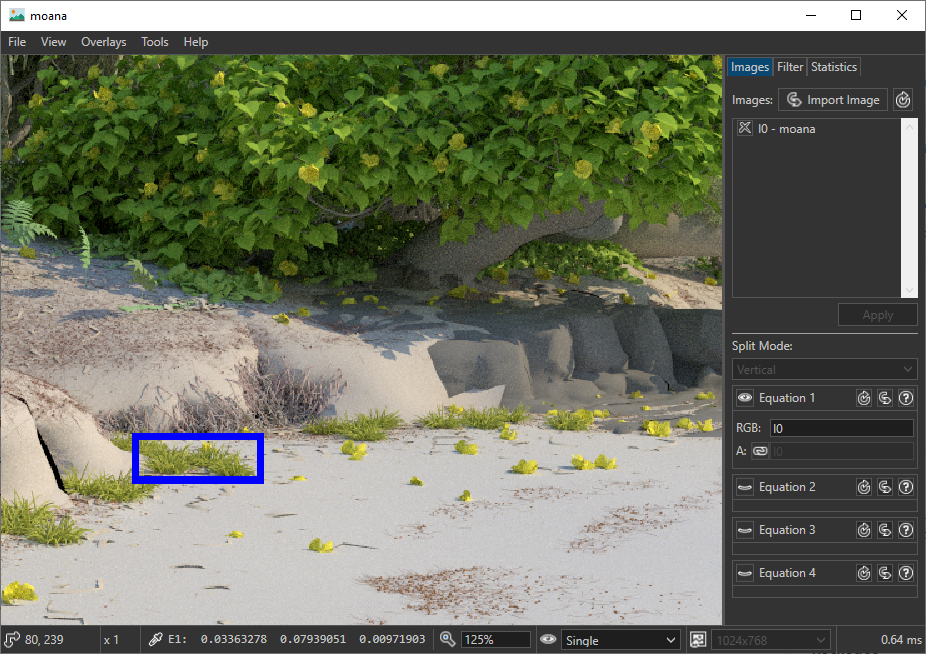
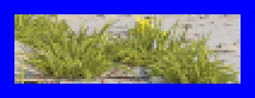
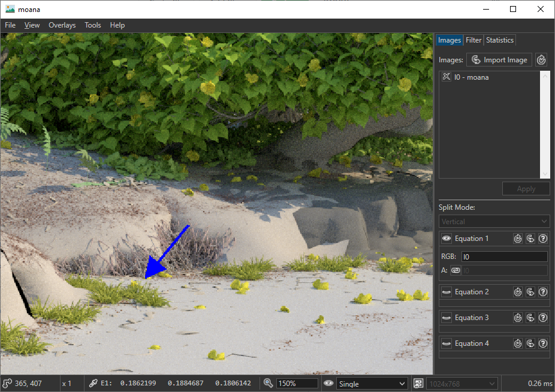

# Overlays

The image viewer support 2 types of overlays that can be useful when prducing imagery for publications.

## Zoombox Overlay

Zoomboxes can be added via **Overlays->Add Zoombox**. The placement area of the zoombox can then be selected by clicking on two distinct texels of the image. Afterwards, a dialog will pop up in which you can select the color and border size of the Zoombox.
In the following example, the blue box was added:

During export (**File->Export**), the contents inside these zoomboxes can be exported as well via the dialog. Make sure to check the **Export Zoom Boxes** checkbox in the second export dialog. The **scale** parameter allows you to upscale the contents inside the Zoombox via nearest neighbor upscaling:

## Arrow Overlay

The arrow overlays can be acessed via **Overlays->Add Arrow**. Place the arrow origin by left clicking any texel in the image. Place the arrowhead by left clicking again. The thickness of the arrow can be changed with the + and - keys after the first left click:

The arrows will be included when using **File->Export**.